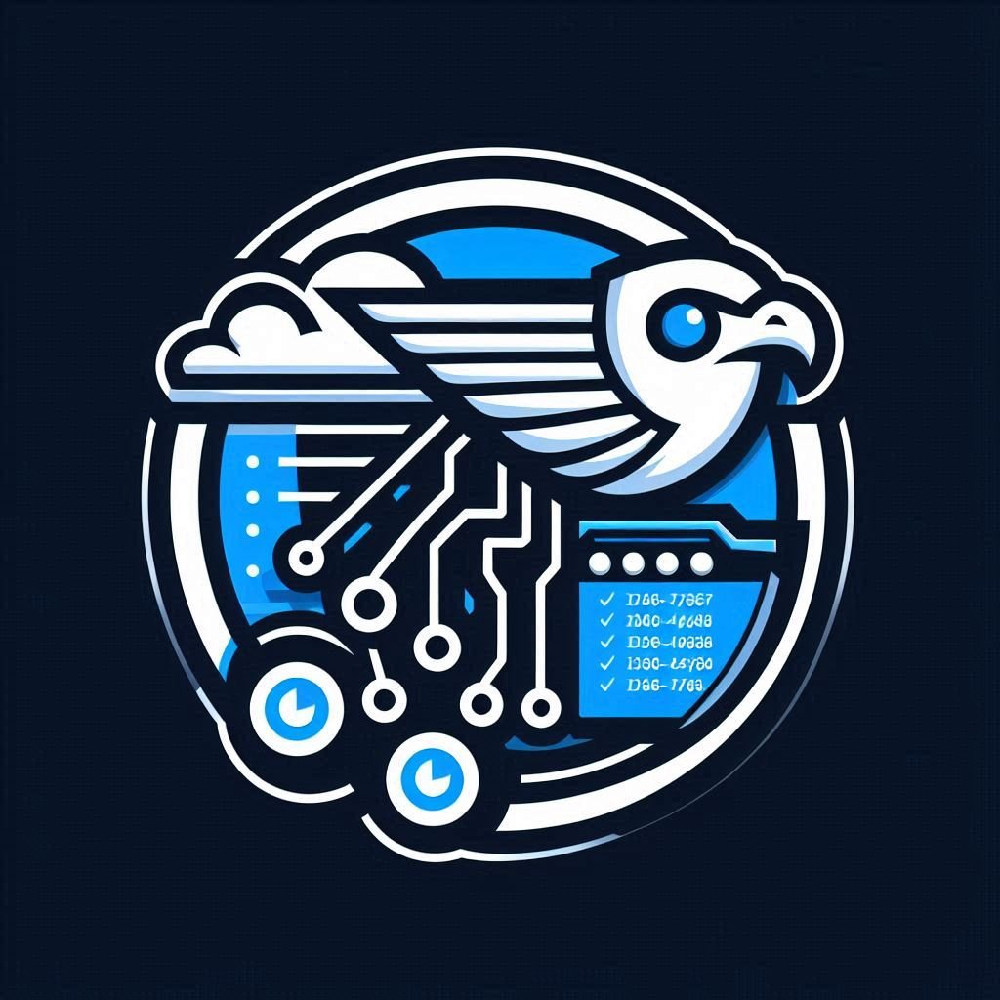
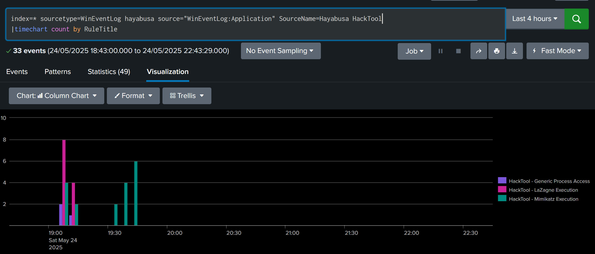
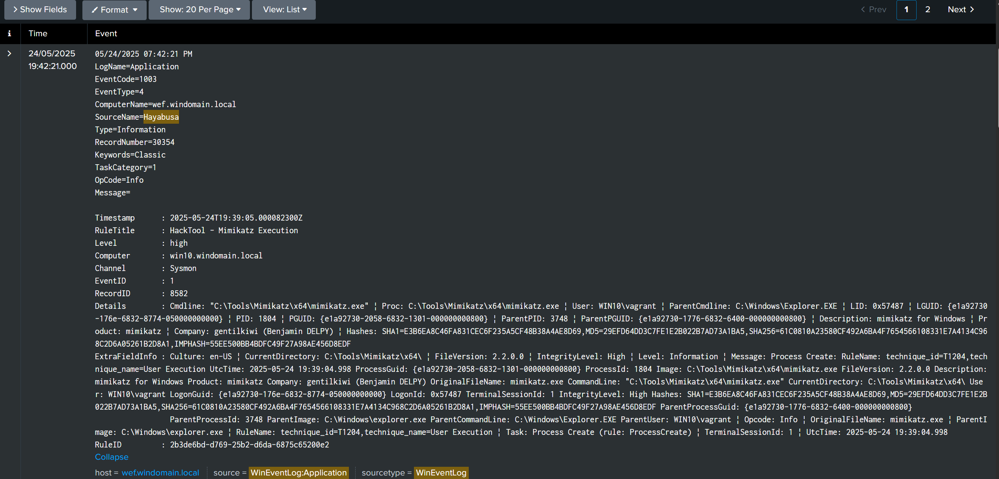

# HayabusaToWineventLog

## Overview

**HayabusatoWineventLog** is a project inspired by [AutorunsToWineventlog](https://github.com/palantir/windows-event-forwarding/tree/master/AutorunsToWinEventLog), designed to improve endpoint event analysis by leveraging the powerful [Hayabusa](https://github.com/Yamato-Security/hayabusa) toolkit. The project allows alerts generated by Hayabusa to be written to the Windows Event Logs, enabling efficient collection and forwarding of security-relevant events without overwhelming your SIEM.

### Key Benefits

#### **Scalability & Efficient Rule Processing**

Thousands of windows endpoint rules are nowadays freely available thanks to outstanding community driven open source initiatives such as [SigmaHQ](https://github.com/SigmaHQ/sigma). Consuming all those rules against raw logs centrally collected in a SIEM may however be a challenge. Distributing the load of rule processing on the endpoints can provide substancial scaling benefits both in terms of endpoints to monitor, logsources to collect and rule to consume.

#### **Seamless Windows Integration**
HayabusatoWineventLog integrates seamlessly with the **Windows Event Log infrastructure**, a proven and widely supported logging mechanism. This ensures that alerts adhere to existing compliance, security, and retention policies while eliminating the need for additional custom ingestion pipelines.

### Limitations & Considerations

While this approach brings significant benefits, there are notable trade-offs:

Unlike traditional SIEM ingestion pipelines that handle log streams continuously, **HayabusatoWineventLog operates on scheduled intervals** to be configured, meaning log collection and detection does not happen exactly in real-time. While this reduces resource consumption, it introduces a delay in threat identification, which may impact time-sensitive security responses.

Since alerts are generated based on periodic scans rather than event-driven triggers, attackers who rapidly execute malicious actions between scan intervals could potentially evade detection. Organizations using HayabusatoWineventLog should **adjust scheduling settings strategically** to balance performance efficiency with response times.

## Usage Instructions

### Installation

An installation script is [hereby](./Install.ps1) provided, it will create an installation folder, fetch the latest release of hayabusa from github, register a scheduled task to run HayabusaToWinEventLog at scheduled intervals and finally assign some SACLs on the installation folder. This install script is suitable for quick testing in a lab but for enterprise deployment it is recommended to make the necessary adjustment to make it suits your specific needs.

### Configuration

The first thing you may want to customize is the scheduled intervals hayabusa runs on the endpoint. By default, the script is meant to run every 15 minutes against the last logs generated in that window. You can adapt this by changing the repetition interval of the scheduled task registered in the installed script and changing the time offset passed as a commandline parameter to hayabusa in the HayabusaToWinEventLog script.

The second thing you may want to tune is the level of the rules you want hayabusa to process, you can adapt the minimum level via a variable in the HayabusaToWinEventLog script directly. Of course you can go beyond that basic settings by customizing the invocation parameter of hayabusa directly or even deploying custom rules in the install folder. By default the minimum level of the rules to be processed is "medium".

### Logs Format Description

HayabusatoWineventLog will generate events coming from a "Hayabusa" Provider in the Application Channel.

There are 7 EventID that maps to different rule levels. Of course the rule level is also available as part of the event data but having dedicated EventID makes events filtering via WEC subscription much easier.

- `EventID 1001`: an emergency level rule triggered 
- `EventID 1002`: a critical level rule triggered 
- `EventID 1003`: a high level rule triggered 
- `EventID 1004`: a medium level triggered 
- `EventID 1005`: a low level rule triggered 
- `EventID 1006`: an informational rule triggered 
- `EventID 9999`: an unknown level rule triggered

The event timestamp will correspond to the time the hayabusa output has been sent to the eventlog, the original timestamp of the event the alert triggered on is also available as event data.

